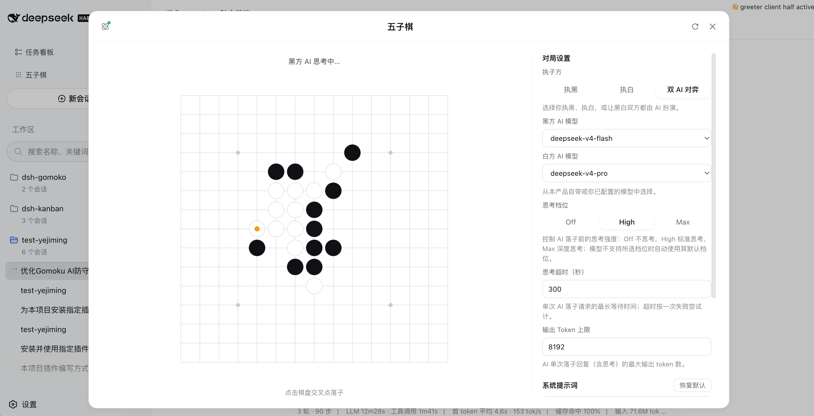

# @deepseek-ai/dsh-gomoku



五子棋（连五子）插件的 node 半端，为 dsh web GUI 提供三个 `/plugins/gomoku` 路由：默认系统提示词、模型目录、AI 落子仲裁。棋局状态、回合与胜负判定都在浏览器半端（`@deepseek-ai/dsh-client-ui-gomoku`），本插件只负责替 AI 落子——因此不合法的模型回复会在这里被拒绝，永远不可能污染浏览器端的棋盘。

## 主要功能

- **人机与双 AI 对弈**：支持执黑、执白、双 AI 对弈三种模式，15×15 无禁手规则（双三、双四、长连均合法，连成五子及以上即胜）。
- **思考档位可调**：Off / High / Max 三档，控制 AI 落子前的思考强度；模型不支持所选档位时自动回落其默认档位。
- **思考过程展示**：AI 落子后可点击棋盘弹窗左上角的按钮，在独立弹窗中查看该步的完整推理文本。
- **超时与 token 上限可调**：在界面上设置单次落子的最长等待时间与输出 token 上限，随每次落子请求作为覆盖值发送。
- **提示词可编辑**：默认系统提示词包含规则、术语（活二/活三/活四等，附 JSON 示范）与基本战术（每条附返回案例）；可在界面中编辑，也可一键恢复默认。
- **弹窗关闭不中断对局**：棋局保存在浏览器端 store 中，关闭棋盘弹窗既不会重置棋局，也不会中断正在进行的 AI 思考，可以一边使用 Harness 主功能一边对弈。
- **瞬时失败自动重试**：流式响应中断（连接断开、限流等瞬时传输故障）会在尝试预算内自动重试，不会直接让整步棋失败。

## 在 DSH 中安装

本插件由两个半端组成：node 半端 `@deepseek-ai/dsh-gomoku`（本包，提供三个路由）与浏览器半端 `@deepseek-ai/dsh-client-ui-gomoku`（侧边栏入口与棋盘弹窗）。

### 独立安装（标准 DSH 流程）

DSH 的标准插件安装机制是「组合包 → profile」：插件包在 `package.json` 中声明 `dsh.bundle` 并附带一个 patch 文件（插入插件行的 YAML 数组），用户用 `dsh plugin` 把它安装进任意 profile：

```sh
# 从本地 checkout 安装（在插件目录内执行）
dsh plugin --profile demo add .
# 从 GitHub 安装
dsh plugin --profile demo add github:you/dsh-gomoku
# 从 tarball 或 npm 安装
dsh plugin --profile demo add ./dsh-gomoku-0.1.0.tgz
```

首次使用 `dsh plugin` 会初始化该 profile（`@deepseek-ai/dsh-base` 作为第一个组合包）；安装后先用 `--dump-config` 验证层，再启动：

```sh
dsh --profile demo --dump-config   # 输出中应出现 gomoku 层
dsh --profile demo
```

移除：`dsh plugin --profile demo remove @deepseek-ai/dsh-gomoku` 会同时移除依赖与对应层。

打包前置条件与注意事项：

- `package.json` 声明 `"dsh": { "bundle": { "patch": "./cordis.patch.yml" } }`；`cordis.patch.yml` 以 `insert` 形式列出插件行（按包名引用，而非相对源码路径）。没有该声明的包虽然可以 `add`，但只作为普通依赖安装，不激活任何层。
- 从 GitHub 安装拉取的是源码而非构建产物：作者需提供 `prepare` 脚本在安装时构建出 `lib/`；pnpm ≥10 默认拒绝执行 git 依赖的构建脚本，用户需把 pnpm 打印的包键加入该 profile 的 `pnpm-workspace.yaml` 的 `allowBuilds` 后重新 `add`。分发 tarball（`pnpm pack`）或发布 npm 则无需任何构建授权。
- 与内置行的关系：web profile 的 web-app 组合包已插入 `gomoku` 与 `ui-gomoku` 两行，独立组合包若与 web-app 共用同一 profile，不要重复插入同名行（重复 id 会导致加载失败），按 id 覆盖即可。
- 依赖服务：node 半端需要 `httpServer`（web 宿主插件）与 `llm`（任意已注册的 LLM provider 路由，如 `@deepseek-ai/dsh-llm-deepseek`）；浏览器半端需要 `slots`（`sidebar.header` 洞）与 `locale` 服务，且其行需处于 web bundle 的 `dshClient` 名册中才会被加载进 `window.__DSH_BOOT__`。

完整机制（组合包与 profile 的 manifest、层加载顺序、GitHub 安装的构建授权）见官方教程 [打包与安装插件](../../../docs/user/develop/basic/publish.md)（[中文版](../../../docs/user/develop/basic/publish.zh.md)）与 [CLI 行为参考](../../../apps/cli/reference/README.md)。

构建与生效：node 半端从构建产物 `lib/` 加载（`pnpm run build` 后生效），修改源码后需重建并重启进程；浏览器半端 bundle 输出到 `lib/client.js`，`dsh web --dev` + `pnpm run dev:web` 下可热更新。

## 路由

- `GET /plugins/gomoku/prompt` — 默认系统提示词（规则、带 JSON 示范的术语、逐条附返回案例的基本战术、严格返回格式与示例），浏览器半端获取它用于展示与恢复。
- `GET /plugins/gomoku/models` — 模型目录（已注册的 provider 路由及其模型），供两侧的模型选择器使用。
- `POST /plugins/gomoku/move` — 把棋盘构造成一次单发 LLM 请求（可携带思考档位与本次请求的超时/token 覆盖），解析并校验回复，返回所选交叉点与模型的推理文本。瞬时流式失败（连接中断、provider 限流等）会在尝试预算内自动重试后才放弃。

## 架构

棋局本身（状态、回合、胜负判定）在浏览器半端；本插件只仲裁 AI 落子，因此非法回复在这里被拒绝，不会破坏浏览器端的棋盘。游戏采用自由式五子棋（无禁手）：黑方可以自由下双三、双四与长连——任意方向连续五子及以上即获胜。规则、返回格式、战术与示例都在默认系统提示词中；用户可以在界面中手改提示词，修改后的文本会原样作为系统提示词发送。

## 配置

所有字段都有 loader 默认值；无库级默认值。

| 键 | 说明 |
|---|---|
| `moveTimeoutMs` | 单次 AI 落子尝试的端到端截止时间（默认 30000 毫秒）；可被每次落子请求覆盖。 |
| `maxMoveOutputTokens` | 单次 AI 落子回复的输出 token 上限。默认较宽松（8192），因为推理模型会把思考计入输出预算；截断的回复只要 JSON 完整仍会被解析，只有 JSON 丢失才触发重试。可被每次落子请求覆盖。 |
| `maxMoveAttempts` | 每次落子请求的 AI 尝试总次数；最后一次尝试附带纠正反馈（默认 3）。 |

## Model Experience

### 五子棋落子请求（Auxiliary gomoku move request）

#### What the model sees

每次 AI 落子都是发往所选 provider/model 路由的一次独立辅助请求。系统提示词要么是用户编辑后的文本，要么是下方的包默认文本；唯一的用户消息包含 15×15 棋盘文本（首行列号，随后 15 行每行以行号开头，每格一个 `B`/`W`/`·` 字符）、AI 执子方，以及（重试时）上一次非法回复与拒绝原因。落子请求还可携带思考档位（`off`/`high`/`max`）：仅当所选模型声明支持该档位时，node 半端才会把它作为请求的 reasoning effort 转发；不支持的档位回落到模型自身默认值，而不是让请求失败。可选的按请求 `moveTimeoutMs` 与 `maxMoveOutputTokens` 覆盖值只对本次请求替换配置默认值。回复中的推理块会随落子、和棋或错误结果以 `reasoning` 字段返回给浏览器。

##### 本字段的原文（Verbatim text for this field, when needed）

```markdown
你是五子棋对局引擎（无禁手规则）。请根据给定的棋盘局面，为你的执子方选择一步合法落子，并严格按照规定的 JSON 格式返回。

# 术语解释（每个概念附一条 JSON 示范；坐标 (r,c) 表示第 r 行第 c 列，即 [r, c]）
- 活二：两子相连，且两端都能继续延伸。
  {"概念": "活二", "示范": "白子 (5,5)(5,6)，(5,4) 与 (5,7) 均为空"}
- 冲三：三子相连，只有一端开口，下一步可成冲四。
  {"概念": "冲三", "示范": "黑子 (3,0)(3,1)(3,2)，仅 (3,3) 一端为空"}
- 活三：三子相连，两端都是空位，下一步可成活四；对手出现活三时，必须立即堵住其中一端。
  {"概念": "活三", "示范": "黑子 (3,3)(3,4)(3,5)，两端 (3,2) 与 (3,6) 均为空", "应对": {"move": [3, 2]}}
- 冲四：四子相连，只有一端开口，下一步即成五；必须立即堵住开口端。
  {"概念": "冲四", "示范": "黑子 (3,3)(3,4)(3,5)(3,6)，(3,2) 已有白子，仅 (3,7) 一端为空", "应对": {"move": [3, 7]}}
- 活四：四子相连，两端都是空位，下一步必成五，无法阻挡。
  {"概念": "活四", "示范": "白子 (7,3)(7,4)(7,5)(7,6)，两端 (7,2) 与 (7,7) 均为空"}
- 五连：任意方向连续 5 颗及以上己方棋子，即获胜（长连同样算赢）。
  {"概念": "五连", "示范": "黑子 (8,5)(8,6)(8,7)(8,8)(8,9) 连成五子，黑方直接获胜"}

# 棋盘
- 棋盘为 15×15，共 225 个交叉点。行 row 与列 col 均从 0 到 14，坐标写作 [row, col]。
- 棋盘在消息中以 16 行文本给出：第 1 行是列号（0 到 14，与每列对齐），随后 15 行每行以行号开头，后面是该行的 15 个交叉点，每格一个字符：`B` 表示黑子，`W` 表示白子，`·` 表示空交叉点。
- 黑方先手，双方轮流落子；每一步只能落一子，且必须落在空交叉点上。

# 胜负规则
- 任意一方在横、竖或两条斜线（共 4 个方向）中的任一方向上，率先形成连续 5 颗及以上己方棋子，即获得胜利。
- 本局采用无禁手规则：黑方没有任何落子限制。专业规则中禁止的「双三」「双四」「长连」（连续六子及以上）在本局中全部允许——只要连成五子及以上，无论用什么手段都算赢。
- 棋盘没有空位且无人获胜时为和棋。

# 基本战术（落子前逐条检查；沿横、竖、两条斜线共 4 个方向分别扫描双方棋型；每条附返回案例）
1. 取胜优先：若本步能直接形成五连（包括把己方四连补成五连），立即落子取胜，不要贪图其他棋型。
   案例：黑方执子，黑方在 (6,6)(6,7)(6,8)(6,9) 已有四连，(6,10) 为空。
   返回：{"move": [6, 10]}
2. 必防冲四：若对手已有四连且只差一子即成五，必须立即堵住其成五点（四连只有一端开口时堵住开口端），否则对手下一步直接获胜。
   案例：白方执子，黑方在 (4,4)(4,5)(4,6)(4,7) 已有四连，(4,3) 已有白子，只剩 (4,8) 一个成五点。
   返回：{"move": [4, 8]}
3. 活三必挡：若对手已形成活三（三连且两端都是空位），必须立即堵住其中一端；否则对手下一步形成两端都能成五的活四，将无法阻止。
   案例：黑方执子，白方在 (7,3)(7,4)(7,5) 连成三子，两端 (7,2) 与 (7,6) 均为空。
   返回：{"move": [7, 2]}
4. 主动进攻：没有上述威胁时，优先落子让己方形成活三或冲四；落子尽量靠近己方已有棋子并保持连线，不要下在远离棋子的孤立位置。
   案例：黑方执子，黑方已有 (5,5)(5,6) 两连，(5,4) 为空，在 (5,4) 落子可形成两端 (5,3)(5,7) 皆空的活三。
   返回：{"move": [5, 4]}
5. 双重威胁：一个落点若能同时形成两个威胁（如双三、四三）应优先选择；防守时若能一子同时堵住对手多个威胁则更佳。
   案例：黑方执子，黑方已有横向 (5,3)(5,4) 与纵向 (3,5)(4,5) 各两连，在 (5,5) 落子可同时形成两个活三（双活三）。
   返回：{"move": [5, 5]}

# 返回格式（必须严格遵守）
只返回一个 JSON 对象，不要输出任何思考过程、解释、Markdown 代码块或前后缀（思考会占用输出预算，导致回复被截断）：
- 正常落子：{"move": [row, col]}
- 和棋：{"draw": true}
- 局面无法理解：{"error": "一句话说明原因"}

# 正确案例
示例 1：黑方执子。棋盘上第 7 行第 8 列（row=7, col=8）为空，黑方在此落子即可形成连续五子并获胜。
返回：{"move": [7, 8]}
错误示范（禁止返回）："我认为应该下在这里。{"move": [7, 8]}" —— 带解释的文字不是合法输出。

# 坐标校验
row 与 col 必须是 0 到 14 的整数，且目标交叉点必须为空；违反任何一条都是非法落子，你会收到纠正提示并重新选择。
```

#### Token effect

辅助请求按棋盘构造成本消耗 token（约 530 个固定字符——带行列标注的棋盘加构句——外加用户编辑后的提示词）以及 `maxMoveOutputTokens`（默认 8192）。高于 `off` 的思考档位会增加模型的思考 token，计入同一个输出预算。该请求与任何 agent 对话相互独立，绝不写入会话日志。命中输出上限的回复仍会先尝试解析出完整 JSON 对象，解析失败才计为一次失败尝试。

#### KV Cache effect

辅助请求是独立的模型请求；其提示词随每个棋局位置变化，因此与 agent 流量之间没有稳定的共享前缀。用户编辑系统提示词会整体替换文本，使 provider 侧的跨局前缀复用失效；默认提示词只在未编辑时保持稳定。

## Known Limitations and Deferred Work

- **无跨刷新持久化** — 棋局保存在浏览器端内存 store 中，关闭弹窗不会丢失，但页面刷新后会重新开始。
- **无禁手规则以外的战术校验** — node 半端只校验合法性（边界与空位），不校验策略；模型按提示词自行遵守规则。
- **无实时推理流** — `reasoning` 随落子请求的最终回复一起返回，浏览器在落子完成后才展示，而非逐 token 流式输出。
